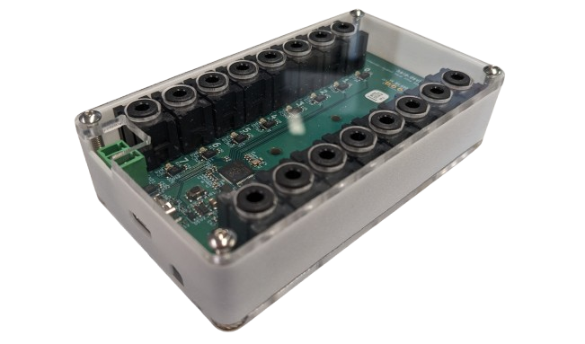
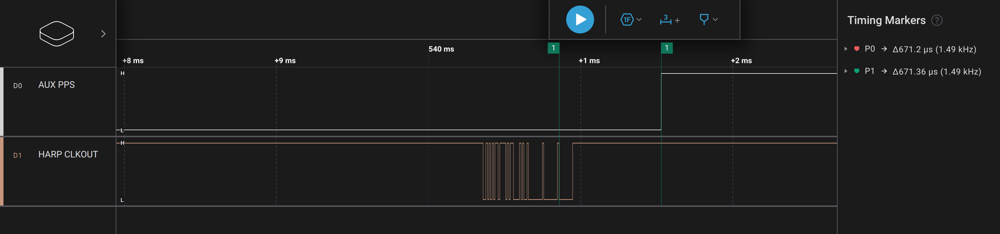
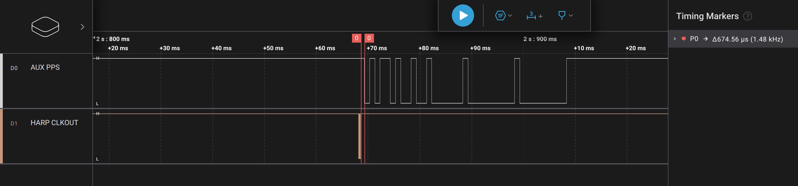
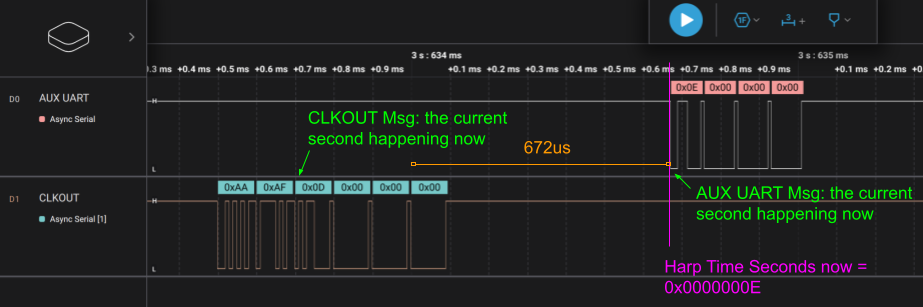

An RP2040-based 16-output [Harp](https://github.com/harp-tech/protocol)-compliant Clock Synchronizer. 

This device can serve as a drop-in replacement for the [Harp-Tech Clock Synchronizer](https://github.com/harp-tech/device.clocksynchronizer) with added capabilities.

## Features
* 16 output channels for distributing clocks to other devices
* 1 input channel for receiving and synchronizing to another clock source
* PPS output
* serial output of the time at user-specifiable baud-rate
* "Used channel detection." Device can identify which channels are in use.

## Auxiliary Output
This device features an auxiliary output that can either produce a *pulse-per-second* (PPS) or UART message at the start of the whole second.
This external signa enables Harp devices to additionally further synchronize with *non*-Harp devices.

### PPS Output
This device optionally outputs a 1[Hz] signal with a 50% duty cycle on the whole second.

Error from the nominal Harp time is < 1[us].

This feature is available on the AUX Port (3-pin terminal block).

### AUX UART Output
This device optionally outputs a the current time in seconds at the start of the whole second.

Error from the nominal Harp time is < 3[us].

This feature is available on the AUX Port (3-pin terminal block), and the baud rate is configurable via Harp Protocol (U32 in Register 36).
